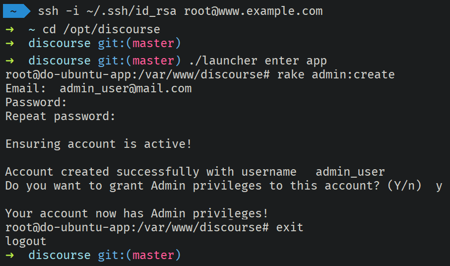

# Create Admin User using Ruby CLI

Before we configure our package, we need to create an Admin user which is not linked to or shares any EVE Online character.

Creating a dedicated Admin User will prevent issues with SSO API key being invalidated due to username change, inactive tokens, character transfers, etc.

> *You must have SSH access and elevated permissions to the server running Discourse to use this method.*

## SSH into the Server

> *In this example we will be using a SSH RSA key to authenticate, if you use a username/password, adjust the code accordingly.*

```shell
ssh -i id_rsa root@www.example.com
```

## Change working Directory

Change the shell working directory to the Discourse root directory. If you followed the installation instructions on this site, it should be `/opt/Discourse`

```shell
ccd /opt/discourse
```

## Enter the Discourse Container

Using the `launcher` script, enter the Discourse Docker container

```shell
./launcher enter app
```

## Create Admin User

Using the Ruby `rake` CLI, initiate the admin user creation and fill in the prompts

```shell
rake admin:create
```

](../../img/create_admin_user_using_ruby_cli.png)