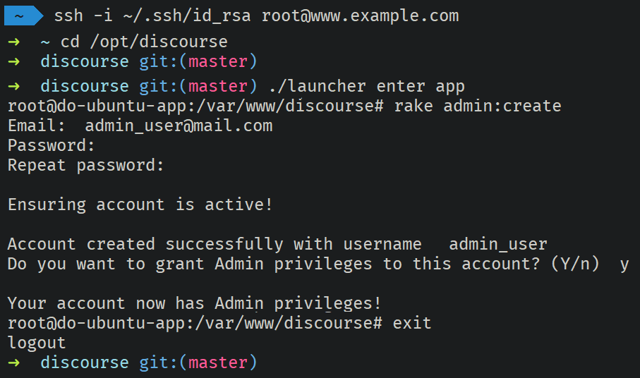

# Create Admin User using Ruby CLI

Creating a dedicated Admin User will prevent issues with SSO API key being invalidated due to username change, inactive tokens, character transfers, etc.

## Create Admin User using Ruby CLI

### SSH into the Server

!!! hint
    You must have SSH access and elevated permissions to the server running Discourse to use this method.

!!! info
    In this example we will be using a SSH RSA key to authenticate, if you use a username/password, adjust the code accordingly.

```shell
ssh -i id_rsa root@www.example.com
```

### Change working Directory

Change the shell working directory to the Discourse root directory. If you followed the installation instructions on this site, it should be `/opt/Discourse`

```shell
ccd /opt/discourse
```

### Enter the Discourse Container

Using the `launcher` script, enter the Discourse Docker container

```shell
./launcher enter app
```

### Create Admin User

Using the Ruby `rake` CLI, initiate the admin user creation and fill in the prompts

```shell
rake admin:create
```

](../img/create_admin_user_using_ruby_cli.png)

## Create Admin User using Admin Sheet

!!! warning
    Discourse must have a functional email provider configured and SSO must be disabled in order to use this method.

### Invite User

Navigate to `discourse.example.com` and log on, top right press the 3 lines and select `Admin`, then go to the User tab and press `Send an Invite` button

[](../img/create_admin_user_using_admin_sheet_1.png)

Once on the User tab, press the `Send an Invite` button again to open the invite dialog; input the email address you intend to use for your Admin User and click `Invite`

[](../img/create_admin_user_using_admin_sheet_2.png)

### Complete User Registration

Wait to receive Discourse email invite at your Admin User's email (ussually takes less than a minute) and use the link in the email to complete the Admin User registration 
(be sure to use a seperate browser instance to not logout your main Admin).

### Grant Admin Role

Using your original Admin account, from the User tab, find an click on the new Admin User that you created, scroll down to the `Permissions` section, locate and press the `Grant Admin` button.

Your initial Admin account will be sent a confirmation email, which will contain a link to confirm and finalize the granting of Admin roles.

[](../img/create_admin_user_using_admin_sheet_3.png)